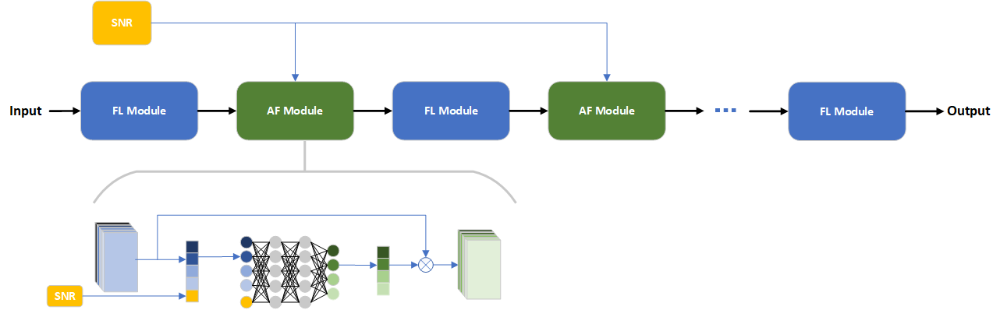
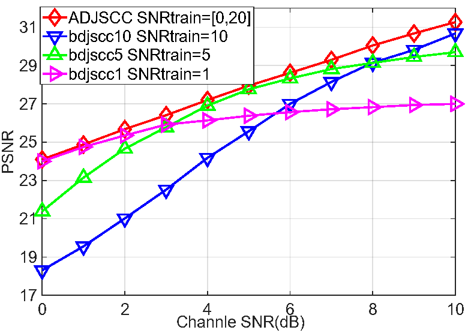
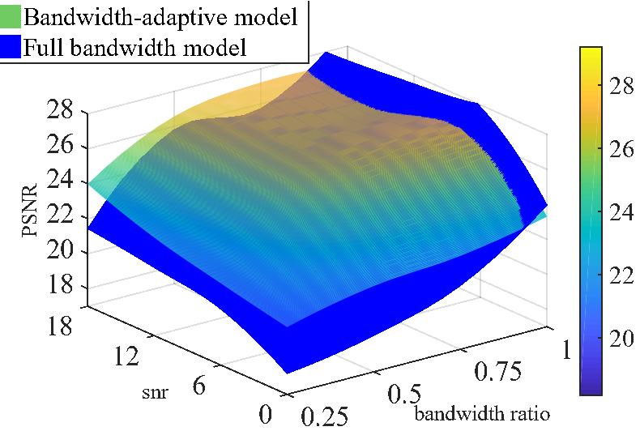

# Multi-type-Data-Adaptive-Semantic-Communication

## A. Project background introduction

### 1. What is semantic communication ?

**Semantic communication** is an innovative intelligent communication method that achieves real-time and reliable intelligent communication by processing and compressing data at the **semantic level**.

### 2. What problems does semantic communication face ?

**Question 1** : The impact of channel quality(signal-to-noise ratio **SNR**) on transmission quality.

**Question 2** : The impact of **bandwidth** limitations on transmission quality.

**Question 3** : Most of the existing semantic communication models are based on a single type of data and cannot use more complex **multimedia** transmission requirements.

### 3. Our solutions

**Model framework**: pytorch construction (DNN): DeepJSCC (Encoder--Decoder) mode

**Data type**: text, image, audio

**Channel Adaptation**: An **attention fusion (AF)** module for neural networks is proposed to dynamically adjust the weight of feature maps in different channels according to the signal-to-noise ratio (snr) to adapt to different channel qualities.

**Bandwidth adaptation**: Use **DQN** deep reinforcement learning to make bandwidth allocation decisions for three types of data to make more reasonable and efficient use of limited bandwidth resources.

## B. Technical realization

### 1. System structure

### 2. Channel adaptation module

An attention fusion (**AF**) module for neural networks is proposed to dynamically adjust the weight of feature maps in different channels according to the SNR to adapt to different channel qualities.

## C. Results

### Channel adaptation experimental results

### Bandwidth adaptation experimental results

## D. Data Set

The **text** data set：The minutes of the European Parliament

The **image** data set：CIFAR_10

The **audio** data set：Edinburgh DataShare
