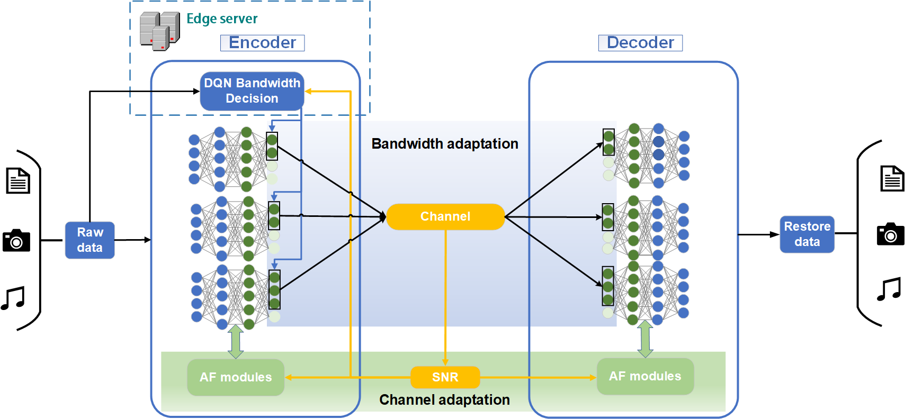
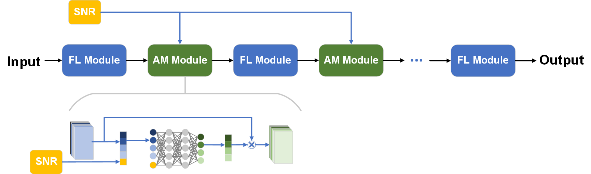

# Multi-type-Data-Adaptive-Semantic-Communication

## System structure diagram：

## Channel adaptation module

## Data Set：
The text data set：the minutes of the European Parliament

The image data set：cifar_10

The audio data se：the speech data set of Edinburgh DataShare
